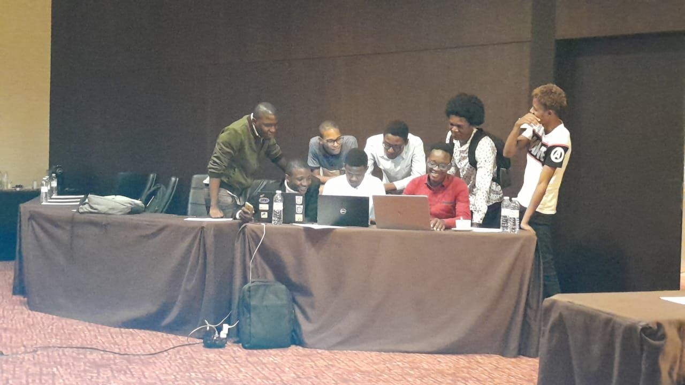
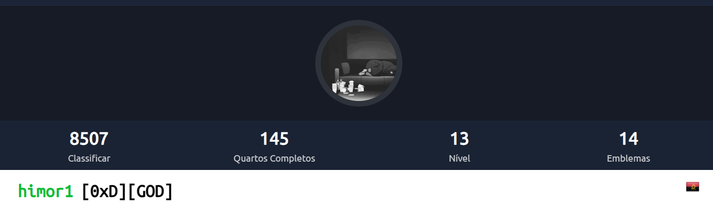

  

 
### Hello! My name is Lucas Pacavira

- 🔭Welcome to my profile. I am a cybersecurity programmer and analyst with a focus on offensive and defensive security. I write scripts and look for vulnerabilities in systems.
- I love playing CTF

 # TryHackMe classification

## Languages

 
  
  
  

 
  
## Find Me!

 
   

